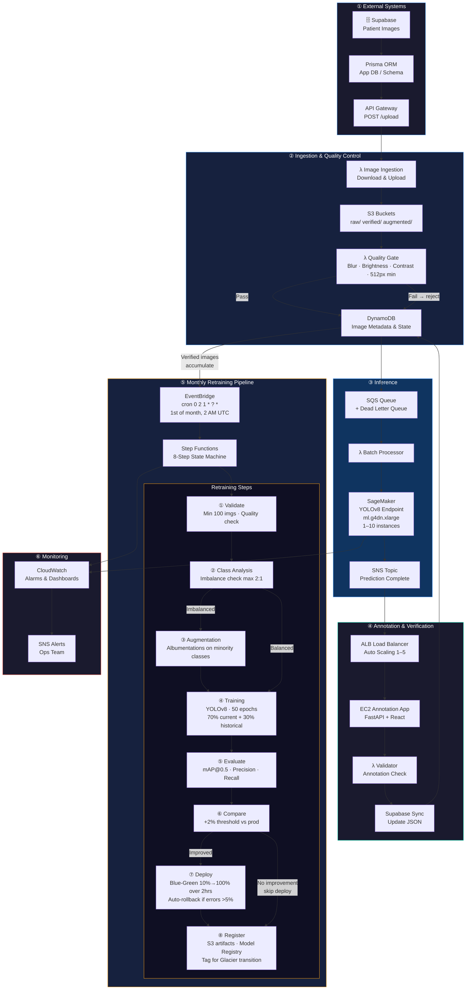

# 🦷 Dental AI ML Pipeline Architecture
> Automated YOLOv8 Retraining & Deployment for Dental Disease Detection

## System Overview

Production ML pipeline processing patient images through **6 layers**: quality validation → real-time YOLOv8 inference → expert annotation → automated monthly retraining & blue-green deployment. Achieves **99.9% uptime**, **<5s P99 latency**, and **10K+ inferences/day**.

---

---

## Architecture Layers

| Layer | Components | Purpose |
|-------|-----------|---------|
| **① External** | Supabase → Prisma ORM → API Gateway | Receive patient image uploads |
| **② Ingestion** | Lambda → S3 → Quality Gate → DynamoDB | Validate & store images with metadata |
| **③ Inference** | SQS → Lambda → SageMaker → SNS | Run YOLOv8 predictions at scale |
| **④ Annotation** | EC2 (FastAPI+React) → ALB → Validator | Dentists review & correct predictions |
| **⑤ Retraining** | EventBridge → Step Functions → 8 steps | Monthly automated model improvement |
| **⑥ Monitoring** | CloudWatch → Alarms → SNS | Observe, alert, and act |

---

## Monthly Retraining Workflow

**Trigger:** EventBridge cron (`0 2 1 * ? *`) → Step Functions 8-step pipeline

- **Steps 1–2 · Validate & Analyse** — Confirms ≥100 images; checks quality; detects class imbalance (threshold: max 2:1 ratio)
- **Step 3 · Augment** — If imbalanced: Albumentations applied to minority classes via SageMaker Processing
- **Step 4 · Train** — YOLOv8, 50 epochs, `ml.g4dn.xlarge` — 70% current data + 30% historical
- **Steps 5–6 · Evaluate & Compare** — Calculates mAP@0.5, precision, recall; deploys only if **+2% improvement** over prod
- **Step 7 · Deploy** — Blue-green: 10% → 100% traffic over 2 hrs; auto-rollback if error rate >5%
- **Step 8 · Register** — Artifacts to S3, lineage in Model Registry, images tagged for Glacier transition

---

## Technical Specifications

<table>
<tr>
<td>

### Quality Gates
| Check | Threshold |
|-------|-----------|
| Blur (Laplacian) | Variance > 100 |
| Brightness | Mean pixel > 30 |
| Contrast | Std dev > 20 |
| Resolution | Min 512×512 px |

</td>
<td>

### Auto-Scaling
| Service | Scale |
|---------|-------|
| SageMaker | 1–10 instances |
| EC2 | 1–5 (70% CPU) |
| DynamoDB | On-demand |
| Lambda | Automatic |

</td>
<td>

### Data Lifecycle
| Stage | Duration |
|-------|----------|
| S3 Standard | 0–90 days |
| Glacier | 90d – 1yr |
| Deep Archive | 1–7 years |

</td>
</tr>
</table>

---

## Production SLAs

| Metric | Target |
|--------|--------|
| Uptime | 99.9% (multi-AZ) |
| Latency P99 | < 5 seconds |
| Daily throughput | 10,000+ inferences |
| Async reliability | DLQs on all queues |

**Security:** HIPAA-compliant · KMS encryption · VPC-only SageMaker endpoints · CloudTrail audit logging · GDPR patient data deletion

---

**Tech Stack:** AWS (SageMaker, Lambda, S3, DynamoDB, Step Functions, EventBridge, CloudWatch) · YOLOv8 · Albumentations · FastAPI · React · Supabase · Prisma

*Dental AI Platform · ML Pipeline Architecture v1.0 · December 2025*