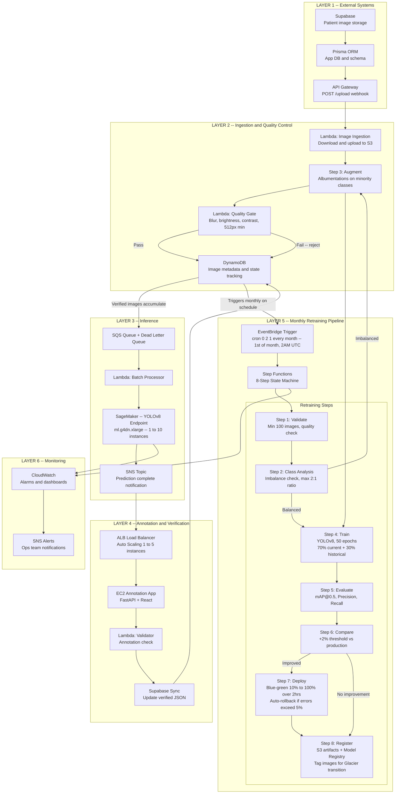

# Dental AI ML Pipeline Architecture
Automated YOLOv8 Retraining and Deployment for Dental Disease Detection

## System Overview

Production ML pipeline processing patient images through 6 layers: quality validation, real-time YOLOv8 inference, expert annotation, and automated monthly retraining with blue-green deployment.

**99.9% uptime** -- **less than 5s P99 latency** -- **10,000+ inferences/day**

---

## Architecture Diagram

---

## Architecture Layers

| Layer | Key Components | Purpose |
|-------|---------------|---------|
| **1 -- External** | Supabase, Prisma ORM, API Gateway | Receive patient image uploads |
| **2 -- Ingestion** | Lambda, S3, Quality Gate, DynamoDB | Validate images and store metadata |
| **3 -- Inference** | SQS, Lambda, SageMaker, SNS | Run YOLOv8 predictions at scale |
| **4 -- Annotation** | EC2 (FastAPI + React), ALB, Validator | Dentists review and correct predictions |
| **5 -- Retraining** | EventBridge, Step Functions, 8 steps | Monthly automated model improvement |
| **6 -- Monitoring** | CloudWatch, SNS Alerts | Observe, alert, and act |

---

## Monthly Retraining Workflow

**Trigger:** EventBridge cron (`0 2 1 * ? *`) fires on the 1st of each month at 2AM UTC, launching an 8-step Step Functions pipeline.

**Steps 1 to 2 -- Validate and Analyse:** Confirms at least 100 images meet quality standards. Detects class imbalance beyond the 2:1 threshold.

**Step 3 -- Augment:** If imbalanced, Albumentations is applied to minority classes via SageMaker Processing.

**Step 4 -- Train:** YOLOv8 trained for 50 epochs on `ml.g4dn.xlarge` using 70% current data and 30% historical data.

**Steps 5 to 6 -- Evaluate and Compare:** Calculates mAP@0.5, precision, and recall. Deploys only if the new model shows at least +2% improvement over production.

**Step 7 -- Deploy:** Blue-green deployment from 10% to 100% traffic over 2 hours. Auto-rollback triggered if error rate exceeds 5%.

**Step 8 -- Register:** Artifacts stored in S3, lineage tracked in Model Registry, images tagged for Glacier transition.

---

## Technical Specifications

### Quality Gates

| Check | Threshold |
|-------|-----------|
| Blur (Laplacian variance) | Greater than 100 |
| Brightness (mean pixel) | Greater than 30 |
| Contrast (std dev) | Greater than 20 |
| Resolution | Minimum 512x512 px |

### Auto-Scaling

| Service | Scale |
|---------|-------|
| SageMaker | 1 to 10 instances |
| EC2 Annotation App | 1 to 5 instances (70% CPU trigger) |
| DynamoDB | On-demand |
| Lambda | Automatic |

### Data Lifecycle

| Stage | Duration |
|-------|----------|
| S3 Standard | 0 to 90 days |
| S3 Glacier | 90 days to 1 year |
| S3 Deep Archive | 1 to 7 years |

---

## Production SLAs

| Metric | Target |
|--------|--------|
| Uptime | 99.9% (multi-AZ) |
| Latency P99 | Less than 5 seconds |
| Daily throughput | 10,000+ inferences |
| Async reliability | Dead Letter Queues on all async operations |

---

## Security

- HIPAA-compliant architecture
- KMS encryption at rest and in transit
- VPC-only SageMaker endpoints
- CloudTrail audit logging enabled
- GDPR patient data deletion support

---

## Tech Stack

**AWS:** SageMaker, Lambda, S3, DynamoDB, Step Functions, EventBridge, CloudWatch, SQS, SNS, EC2, ALB, API Gateway

**ML:** YOLOv8, Albumentations

**App:** FastAPI, React, Supabase, Prisma ORM

---

*Dental AI Platform -- ML Pipeline Architecture v1.0 -- December 2025*
